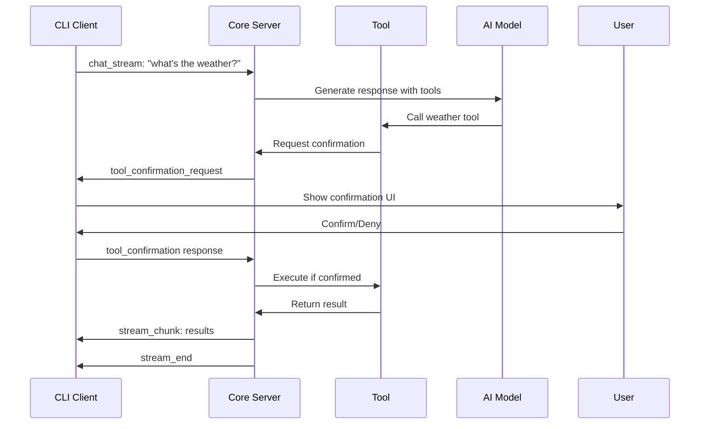

# Ruby WebSocket Architecture

This document describes the WebSocket-based distributed architecture that enables Ruby CLI to communicate with Ruby Core server in real-time.

## Overview

Ruby uses a client-server architecture where:
- **Ruby Core Server**: Handles AI processing, tool execution, and session management
- **Ruby CLI Client**: Provides terminal interface and connects to server via HTTP/WebSocket
- **WebSocket Protocol**: Enables real-time streaming responses and tool confirmations

## Architecture Diagram

```
┌─────────────────┐     HTTP REST API     ┌─────────────────┐
│                 │    ┌─────────────────► │                 │
│   Ruby CLI      │    │  Session Mgmt    │   Ruby Core     │
│   (Client)      │    │                  │   Server        │
│                 │    │   WebSocket      │                 │
│                 │ ◄──┴─────────────────► │                 │
└─────────────────┘    Streaming Chat     └─────────────────┘
                       Tool Confirmations
```

## Communication Protocols

### HTTP REST API

Used for session lifecycle management:

#### Create Session
```http
POST /api/sessions
Content-Type: application/json

{
  "systemPrompt": "you are ruby, a helpful ai assistant..."
}

Response: {"sessionId": "abc123"}
```

#### Get Messages
```http
GET /api/sessions/{sessionId}/messages

Response: {"messages": [...]}
```

#### Delete Session
```http
DELETE /api/sessions/{sessionId}

Response: {"success": true}
```

#### Health Check
```http
GET /health

Response: {"status": "ok", "sessions": 5}
```

### WebSocket Streaming Protocol

WebSocket connections handle real-time chat streaming and tool confirmations.

#### Message Types

##### 1. Chat Stream Request (Client → Server)
```json
{
  "type": "chat_stream",
  "sessionId": "abc123",
  "userMessage": "what's the weather in tokyo?"
}
```

##### 2. Stream Start (Server → Client)
```json
{
  "type": "stream_start"
}
```

##### 3. Stream Chunk (Server → Client)
```json
{
  "type": "stream_chunk",
  "content": "I'll get the weather information for you."
}
```

##### 4. Tool Confirmation Request (Server → Client)
```json
{
  "type": "tool_confirmation_request",
  "confirmationId": "xyz789",
  "toolName": "get_weather",
  "args": {"location": "Tokyo"},
  "message": "fetch weather data for Tokyo?"
}
```

##### 5. Tool Confirmation Response (Client → Server)
```json
{
  "type": "tool_confirmation",
  "confirmationId": "xyz789",
  "confirmed": true
}
```

##### 6. Stream End (Server → Client)
```json
{
  "type": "stream_end"
}
```

##### 7. Error (Server → Client)
```json
{
  "type": "error",
  "error": "session not found"
}
```

## Tool Confirmation Flow

The tool confirmation system allows tools to request user approval before execution:



## Session Management

### Session Lifecycle

1. **Create**: Client calls `POST /api/sessions` to create new session
2. **Chat**: Client opens WebSocket and sends `chat_stream` messages
3. **Stream**: Server streams responses and handles tool confirmations
4. **Cleanup**: Client calls `DELETE /api/sessions/{id}` when done

### Session State

Each session maintains:
- `id`: Unique session identifier
- `messages[]`: Conversation history
- `provider`: AI provider instance
- `tools`: Available tool implementations
- `systemPrompt`: System prompt for AI behavior
- `ws`: Active WebSocket connection (if streaming)

## Error Handling

### Connection Errors
- WebSocket connection failures are retried automatically
- HTTP API failures throw descriptive errors
- Tool confirmation timeouts (30s) auto-deny requests

### Streaming Errors
- Parse errors in WebSocket messages are logged and ignored
- AI provider errors are sent as `error` message type
- Session not found errors terminate the stream

## Tool Integration

### Tool Definition
Tools are defined using ai-sdk's `tool()` function with confirmation support:

```typescript
export const weatherTool = tool({
  description: 'Get weather information',
  inputSchema: z.object({
    location: z.string(),
  }),
  execute: async ({ location }) => {
    // Request confirmation before execution
    const confirmed = await requestConfirmation(
      'get_weather',
      { location },
      `fetch weather data for ${location}?`
    );
    
    if (!confirmed) {
      return { error: 'cancelled by user' };
    }
    
    // Execute tool logic
    return { weather: 'sunny' };
  },
});
```

### Tool Confirmation Handler
The server sets a global confirmation handler that:
1. Finds the active WebSocket session
2. Sends confirmation request to client
3. Waits for client response
4. Returns confirmation result to tool

## Performance Considerations

### WebSocket Connection Management
- One WebSocket per active chat stream
- Connections are automatically closed after streaming completes
- Failed connections are cleaned up with timeouts

### Session Storage
- Sessions stored in memory Map for fast access
- Sessions cleaned up when explicitly deleted
- No automatic session expiration (should be added for production)

### Message Queuing
- Incoming WebSocket messages are queued and processed sequentially
- Tool confirmations are handled out-of-band to avoid blocking stream
- Message parsing errors don't interrupt the stream

## Security Considerations

### Authentication
- Currently no authentication implemented (development only)
- Production should add API key or JWT authentication
- WebSocket connections should validate session ownership

### Input Validation
- All HTTP request bodies should be validated
- WebSocket message types should be validated
- Tool arguments are validated by ai-sdk schemas

### Error Information
- Error messages should not leak sensitive information
- Stack traces should be sanitized in production
- Tool execution should be sandboxed

## Development and Debugging

### Logging
- Server logs WebSocket connections and disconnections
- Tool confirmation requests/responses are logged
- AI provider interactions can be logged for debugging

### Testing
- HTTP endpoints can be tested with standard HTTP clients
- WebSocket connections can be tested with `wscat` or custom scripts
- Integration tests use the `test-http.js` script

### Monitoring
- `/health` endpoint provides basic server status
- WebSocket connection count is tracked
- Session count is exposed in health check

## Future Enhancements

### Scalability
- Add Redis for session storage across multiple server instances
- Implement WebSocket connection pooling
- Add load balancing for multiple server replicas

### Features
- Add typing indicators during AI response generation
- Support multiple concurrent tool confirmations
- Add file upload/download over WebSocket
- Implement conversation branching and history

### Security
- Add proper authentication and authorization
- Implement rate limiting for API endpoints
- Add input sanitization and validation
- Secure WebSocket connections with WSS